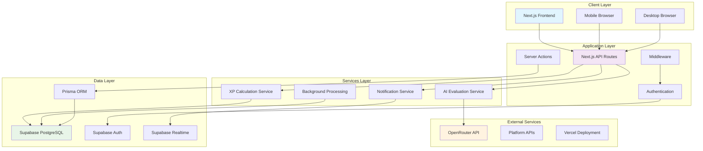
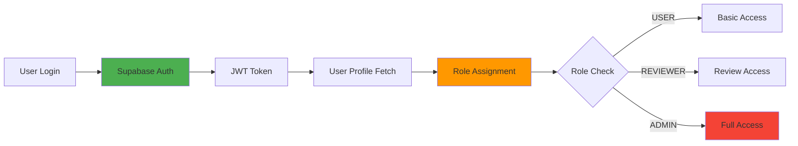
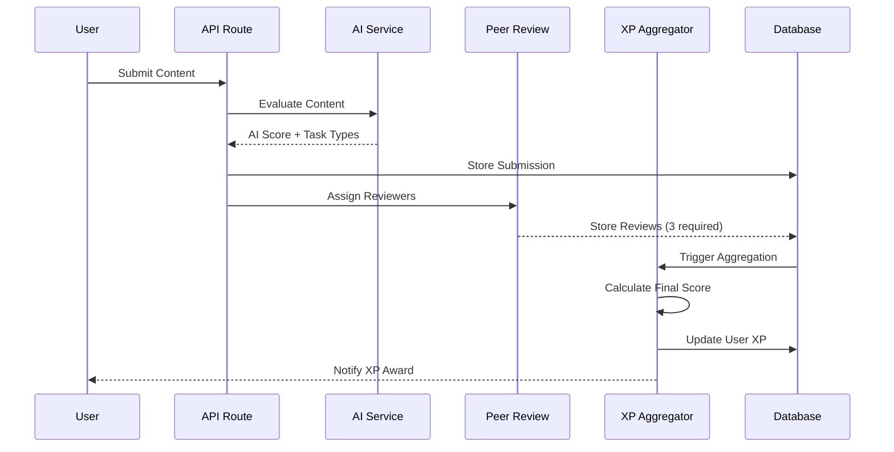
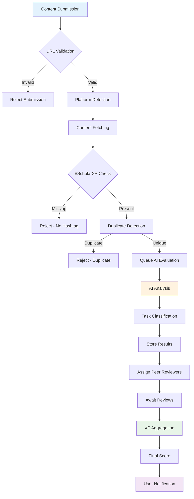
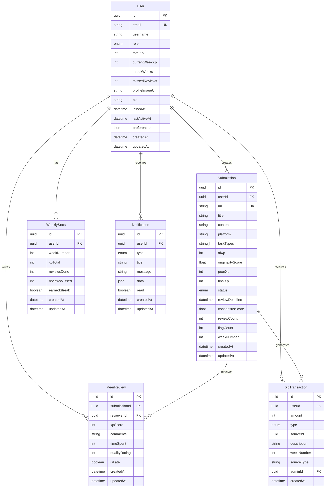
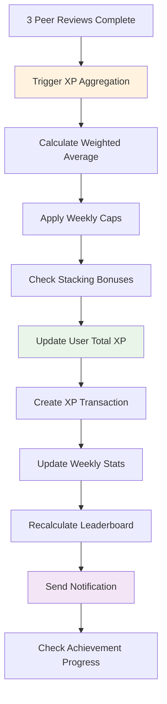
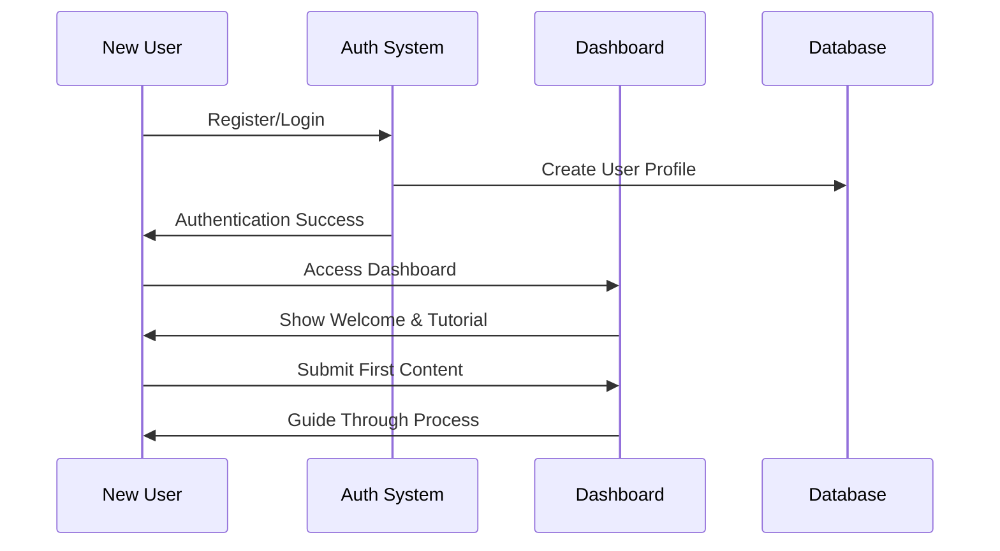
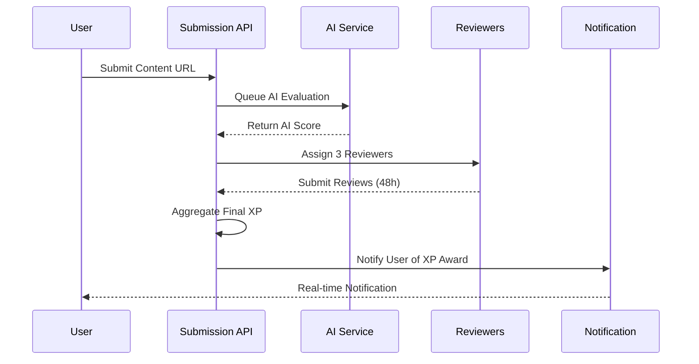
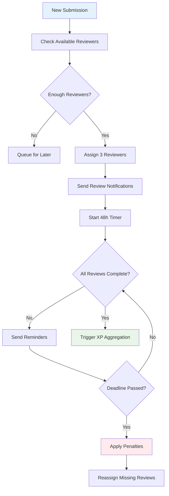

# Scholars_XP System Architecture Documentation

**Version**: 3.0  
**Last Updated**: 2025  
**Status**: Production-Ready Core with Comprehensive Documentation

## Executive Summary

Scholars_XP is a comprehensive gamified content evaluation platform built with Next.js 15, Supabase, and PostgreSQL. The system enables users to submit content from various platforms (Twitter/X, Medium, Reddit, Notion) for AI-powered evaluation and peer review, implementing a sophisticated role-based access control system with three distinct user roles: USER, REVIEWER, and ADMIN.

### Key Architectural Principles

- **Serverless-First**: Designed for Vercel's serverless platform with database-backed persistence
- **Real-time Capabilities**: Supabase Realtime integration for instant notifications and updates
- **Security-Focused**: Multi-layered security with authentication, authorization, and data protection
- **Scalable Design**: Horizontal scaling through serverless functions and database optimization
- **Performance Optimized**: Efficient queries, caching strategies, and background processing

## System Architecture Overview



## Core Components Architecture

### 1. Authentication System (Supabase Auth + RBAC)

**Implementation**: `src/contexts/AuthContext.tsx`, `src/lib/auth-middleware.ts`



**Role Hierarchy**:
- **USER** (Level 1): Content submission, view own data
- **REVIEWER** (Level 2): All USER permissions + peer review capabilities
- **ADMIN** (Level 3): All permissions + system management

**Security Features**:
- JWT-based authentication with automatic refresh
- Row Level Security (RLS) policies in Supabase
- Session management with secure cookie handling
- Role-based route protection via middleware

### 2. Task System & XP Calculation

**Implementation**: `src/lib/task-types.ts`, `src/lib/xp-aggregator.ts`

The system supports 6 distinct task types with specific XP ranges and weekly limits:

| Task | Description | XP Range | Weekly Cap | Platform Restrictions |
|------|-------------|----------|------------|----------------------|
| A | Thread/Long Article | 20-30 | 90 | Twitter (5+ tweets) |
| B | Platform Article | 75-150 | 450 | Reddit/Notion/Medium only (2000+ chars) |
| C | Tutorial/Guide | 20-30 | 90 | Any platform |
| D | Protocol Explanation | 50-75 | 225 | Any platform |
| E | Correction Bounty | 50-75 | 225 | Any platform |
| F | Strategies | 50-75 | 150-225 | Any platform |

**XP Calculation Flow**:



### 3. Content Submission & Evaluation Workflow

**Implementation**: `src/app/api/submissions/route.ts`, `src/lib/ai-evaluator.ts`



### 4. Notification System (Supabase Realtime)

**Implementation**: `src/lib/notifications.ts`, `src/components/NotificationCenter.tsx`

**Real-time Architecture**:
- Database triggers create notifications
- Supabase Realtime broadcasts changes
- Frontend subscribes to user-specific channels
- Automatic UI updates without page refresh

**Notification Types**:
- XP_AWARDED: Content evaluation completed
- REVIEW_ASSIGNED: New peer review assignment
- STREAK_ACHIEVED: Weekly streak milestone
- PENALTY_APPLIED: Missed review penalty
- ROLE_PROMOTED: User role upgrade

### 5. Admin Dashboard Functionality

**Implementation**: `src/app/admin/`, `src/app/api/admin/`

**Administrative Capabilities**:
- User management and role assignments
- Content moderation and flagging
- Manual XP adjustments with audit trails
- System analytics and performance monitoring
- Background job management and monitoring

## Database Schema & Relationships



## API Endpoints Documentation

### Content Management APIs

| Endpoint | Method | Auth | Purpose | Implementation |
|----------|--------|------|---------|----------------|
| `/api/submissions` | POST | User | Submit content for evaluation | `src/app/api/submissions/route.ts` |
| `/api/submissions` | GET | User | List user submissions | `src/app/api/submissions/route.ts` |
| `/api/validate-content` | POST | User | Real-time content validation | `src/app/api/validate-content/route.ts` |
| `/api/evaluate` | POST | User | Trigger AI evaluation | `src/app/api/evaluate/route.ts` |

### Peer Review APIs

| Endpoint | Method | Auth | Purpose | Implementation |
|----------|--------|------|---------|----------------|
| `/api/peer-reviews/pending` | GET | Reviewer | Get pending reviews | `src/app/api/peer-reviews/pending/route.ts` |
| `/api/peer-reviews` | POST | Reviewer | Submit peer review | `src/app/api/peer-reviews/route.ts` |
| `/api/assignments/my` | GET | Reviewer | Get reviewer assignments | `src/app/api/assignments/my/route.ts` |

### User & Analytics APIs

| Endpoint | Method | Auth | Purpose | Implementation |
|----------|--------|------|---------|----------------|
| `/api/user/profile` | GET | User | Get user profile and XP data | `src/app/api/user/profile/route.ts` |
| `/api/user/xp-breakdown` | GET | User | Detailed XP analytics | `src/app/api/user/xp-breakdown/route.ts` |
| `/api/leaderboard` | GET | User | Weekly and all-time rankings | `src/app/api/leaderboard/route.ts` |
| `/api/notifications` | GET | User | User notifications | `src/app/api/notifications/route.ts` |

### Administrative APIs

| Endpoint | Method | Auth | Purpose | Implementation |
|----------|--------|------|---------|----------------|
| `/api/admin/stats` | GET | Admin | System statistics | `src/app/api/admin/stats/route.ts` |
| `/api/admin/users` | POST | Admin | User management | `src/app/api/admin/users/route.ts` |
| `/api/admin/submissions/[id]` | PATCH | Admin | Manage submissions | `src/app/api/admin/submissions/[id]/route.ts` |
| `/api/admin/update-xp` | POST | Admin | Manual XP adjustments | `src/app/api/admin/update-xp/route.ts` |

## Services Architecture

### AI Evaluation Service

**File**: `src/lib/ai-evaluator.ts`

**Responsibilities**:
- Content fetching from various platforms
- AI-powered quality assessment using OpenRouter GPT-4
- Task type classification and XP scoring
- Originality detection and spam prevention

**Integration**: OpenRouter API with fallback error handling

### Background Processing Services

**Files**: `src/lib/submission-processing-queue.ts`, `src/lib/ai-evaluation-queue.ts`

**Queue Management**:
- Database-backed job queues for serverless environments
- Automatic retry mechanisms for failed operations
- Priority-based processing for time-sensitive tasks
- Comprehensive error logging and monitoring

**Scheduled Operations**:
- Weekly XP aggregation and leaderboard updates
- Notification cleanup and data maintenance
- System health monitoring and alerting

**Realtime Role Sync**:
- Database trigger (`supabase/migrations/20251015_sync_reviewer_roles.sql`) promotes users to `REVIEWER` once they cross 1000 XP and demotes them back to `USER` if they fall below the threshold, without relying on pg_cron.

### XP Propagation Service

**File**: `src/lib/services/xp-propagation.ts`

**Functionality**:
- Cascading XP updates across related entities
- Weekly statistics recalculation
- Leaderboard position updates
- Achievement progress tracking
- Audit trail maintenance for all XP changes

## Data Flow Diagrams

### Content Submission Flow

```mermaid
flowchart LR
    A[User Submits URL] --> B[Fast Validation]
    B --> C[Queue Background Processing]
    C --> D[Return Immediate Response]
    D --> E[Background: Fetch Content]
    E --> F[Background: AI Evaluation]
    F --> G[Background: Store Results]
    G --> H[Background: Assign Reviewers]
    H --> I[Real-time: Notify User]
    
    style A fill:#e3f2fd
    style D fill:#e8f5e8
    style I fill:#f3e5f5
```



### XP Calculation & Distribution



## Security Architecture

### Authentication & Authorization

**Multi-layered Security**:
1. **Supabase Auth**: JWT-based authentication with automatic refresh
2. **Middleware Protection**: Route-level authentication checks
3. **API Guards**: Endpoint-specific permission validation
4. **Database RLS**: Row-level security policies in PostgreSQL

### Data Protection Measures

**Input Validation**:
- URL format and platform verification
- Content length and hashtag requirements
- XP score bounds checking
- SQL injection prevention via Prisma ORM

**Rate Limiting**:
- PostgreSQL-based rate limiting for serverless compatibility
- Per-user submission and review limits
- API endpoint throttling
- Abuse detection and prevention

**Security Headers**:
- Content Security Policy (CSP)
- XSS protection headers
- CSRF protection
- Secure cookie configuration

## Performance Optimization

### Database Optimization

**Indexing Strategy**:
- Composite indexes for common query patterns
- Performance indexes for analytics queries
- Optimized foreign key relationships
- Query execution plan monitoring

**Connection Management**:
- Prisma connection pooling
- Supabase connection limits optimization
- Query batching for bulk operations
- Database connection monitoring

### Caching Strategy

**Application-Level Caching**:
- In-memory caching for frequently accessed data
- Redis-compatible caching for production scaling
- Cache invalidation strategies
- Performance monitoring and optimization

### Frontend Performance

**Next.js Optimizations**:
- App Router for improved performance
- Server-side rendering (SSR) where appropriate
- Static generation for public pages
- Image optimization and lazy loading

## Deployment Architecture

### Vercel Serverless Deployment

**Configuration**:
- Next.js 15 with App Router
- Serverless functions for API routes
- Edge middleware for authentication
- Environment variable management

**Production Considerations**:
- Database connection pooling
- Background job processing via Supabase pg_cron
- Real-time subscriptions via Supabase Realtime
- CDN optimization for static assets

### Environment Configuration

**Required Environment Variables**:
```env
# Database
DATABASE_URL="postgresql://..."
DIRECT_URL="postgresql://..."

# Supabase
NEXT_PUBLIC_SUPABASE_URL="https://..."
NEXT_PUBLIC_SUPABASE_ANON_KEY="..."
SUPABASE_SERVICE_ROLE_KEY="..."

# AI Services
OPENROUTER_API_KEY="..."

# Feature Flags
ENABLE_AI_EVALUATION=true
ENABLE_LEGACY_DUPLICATE_CHECK=true
```

## Monitoring & Observability

### Application Monitoring

**Logging Strategy**:
- Structured logging with appropriate log levels
- Error tracking and alerting
- Performance metrics collection
- User activity monitoring

**Health Checks**:
- Database connectivity monitoring
- External service availability checks
- Background job processing status
- Real-time feature functionality

### Analytics & Insights

**User Analytics**:
- XP earning patterns and trends
- Content submission analytics
- Peer review participation metrics
- User engagement and retention

**System Analytics**:
- API endpoint performance
- Database query optimization
- Background job processing times
- Error rates and patterns

## Critical User Journeys

### New User Onboarding



### Content Evaluation Journey



### Reviewer Assignment & Workflow



## Scalability Considerations

### Horizontal Scaling Strategy

**Serverless Architecture Benefits**:
- Automatic scaling based on demand
- No server management overhead
- Pay-per-execution cost model
- Global edge distribution

**Database Scaling**:
- Supabase PostgreSQL with connection pooling
- Read replicas for analytics queries
- Database partitioning for large datasets
- Query optimization and indexing

### Performance Bottlenecks & Solutions

**Identified Bottlenecks**:
1. **AI Evaluation Latency**: Mitigated by background processing
2. **Database Connections**: Managed via Prisma connection pooling
3. **Real-time Subscriptions**: Optimized with targeted channel subscriptions
4. **Large Dataset Queries**: Addressed with pagination and caching

**Scaling Solutions**:
- Background job queues for heavy operations
- Database-backed rate limiting for serverless environments
- Efficient query patterns with proper indexing
- CDN utilization for static content

## Disaster Recovery & Business Continuity

### Backup Strategy

**Database Backups**:
- Supabase automatic daily backups
- Point-in-time recovery capability
- Cross-region backup replication
- Regular backup restoration testing

**Application Recovery**:
- Version control with Git
- Vercel deployment rollback capability
- Environment variable backup
- Configuration management

### Monitoring & Alerting

**Critical Metrics**:
- Database connection health
- API endpoint response times
- Background job processing rates
- User authentication success rates
- Real-time feature availability

**Alert Thresholds**:
- API response time > 5 seconds
- Database connection failures
- Background job failure rate > 5%
- User authentication failure rate > 10%

## Future Architecture Enhancements

### Phase 1 Improvements (Next 3 months)

1. **Enhanced Caching Layer**:
   - Redis integration for production scaling
   - Intelligent cache invalidation
   - Query result caching

2. **Advanced Analytics**:
   - Real-time analytics dashboard
   - User behavior tracking
   - Performance metrics visualization

3. **Mobile Application**:
   - React Native mobile app
   - Push notifications
   - Offline capability

### Phase 2 Enhancements (6-12 months)

1. **Microservices Architecture**:
   - Service decomposition for better scalability
   - API gateway implementation
   - Service mesh for communication

2. **Advanced AI Features**:
   - Multiple AI model integration
   - Custom model training
   - Improved content analysis

3. **Blockchain Integration**:
   - XP tokenization
   - Decentralized governance
   - Smart contract automation

### Phase 3 Vision (12+ months)

1. **Multi-tenant Architecture**:
   - Support for multiple organizations
   - Custom branding and configuration
   - Isolated data environments

2. **Advanced Gamification**:
   - Complex achievement systems
   - Social features and collaboration
   - Competitive tournaments

3. **AI-Powered Insights**:
   - Predictive analytics
   - Personalized recommendations
   - Automated content curation

## Technical Debt & Maintenance

### Current Technical Debt

1. **Error Handling**: Standardize error responses across all endpoints
2. **Testing Coverage**: Increase automated test coverage to >80%
3. **Documentation**: Complete API documentation with OpenAPI specs

### Maintenance Schedule

**Weekly**:
- Database performance monitoring
- Security vulnerability scanning
- Dependency updates review

**Monthly**:
- Code quality assessment
- Performance optimization review
- User feedback analysis and prioritization

**Quarterly**:
- Architecture review and planning
- Security audit and penetration testing
- Disaster recovery testing

## Conclusion

The Scholars_XP system represents a sophisticated, production-ready application built on modern web technologies. Its architecture emphasizes:

- **Security**: Multi-layered authentication and authorization
- **Scalability**: Serverless architecture with database optimization
- **Performance**: Efficient queries, caching, and background processing
- **Reliability**: Comprehensive error handling and monitoring
- **Maintainability**: Clean code structure and comprehensive documentation

The system is well-positioned for future growth and enhancement while maintaining stability and performance in production environments.

---

