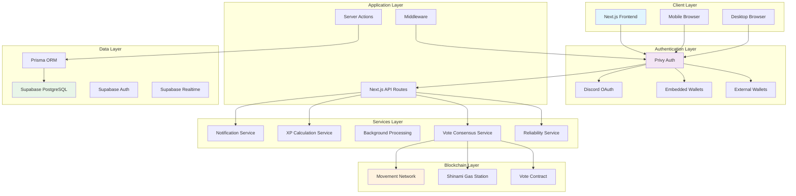
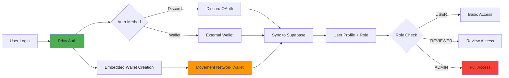
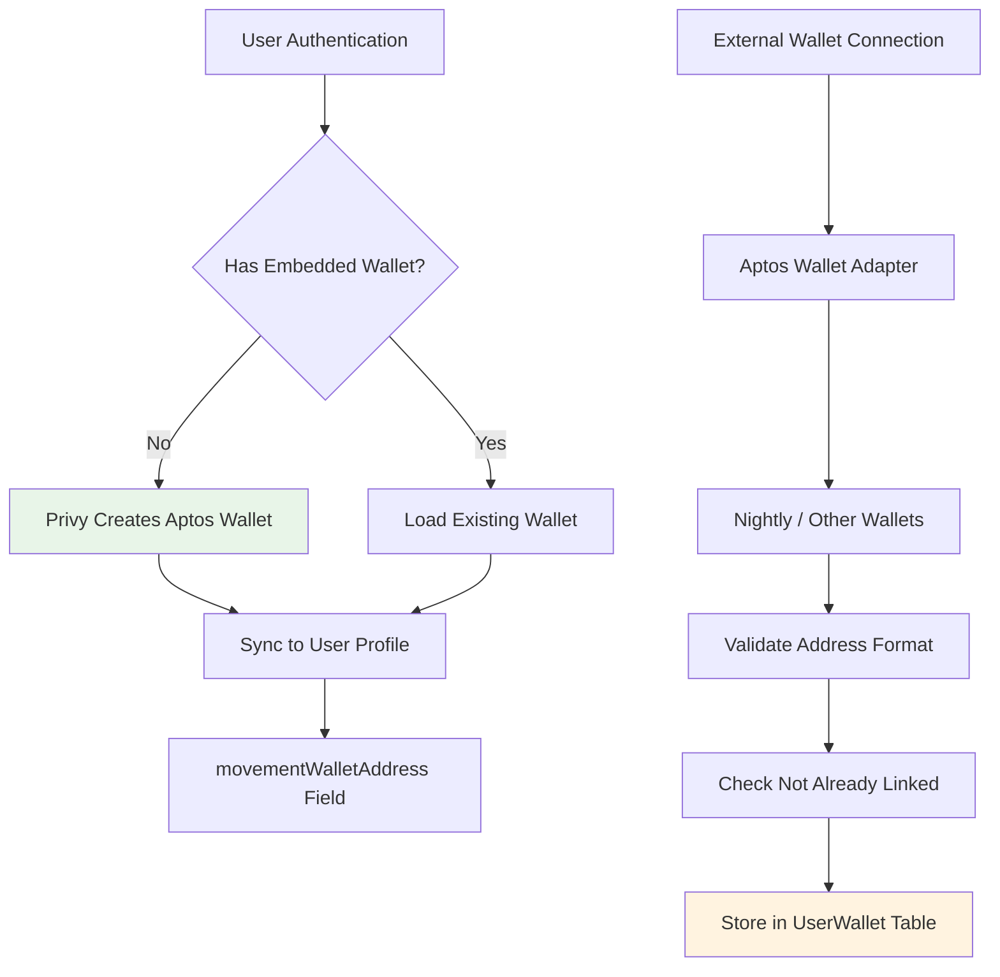
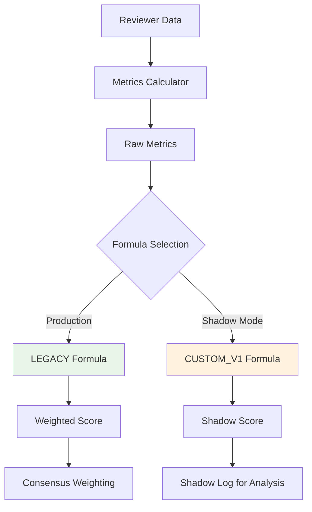
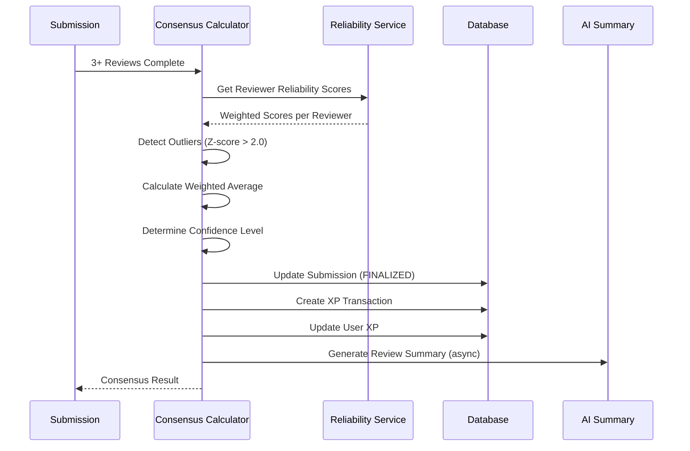
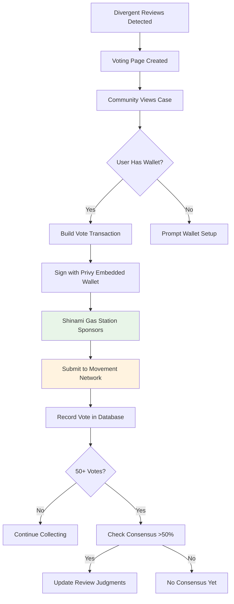
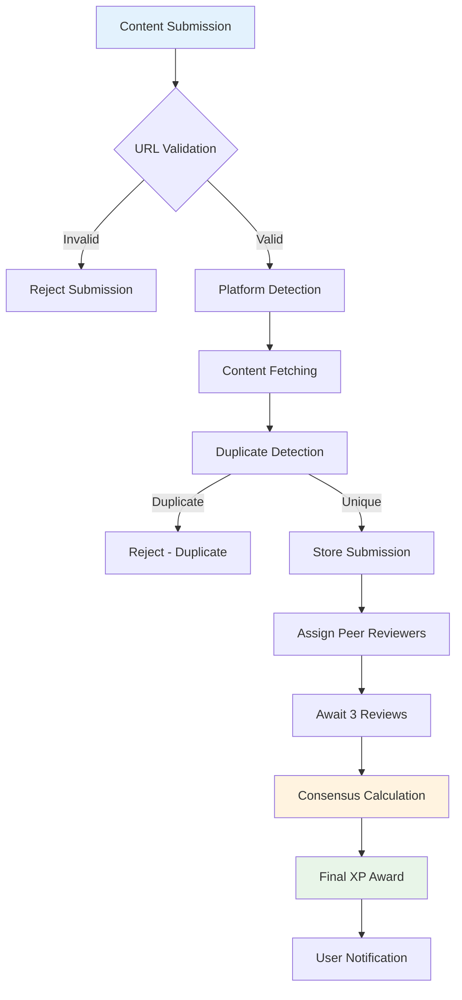
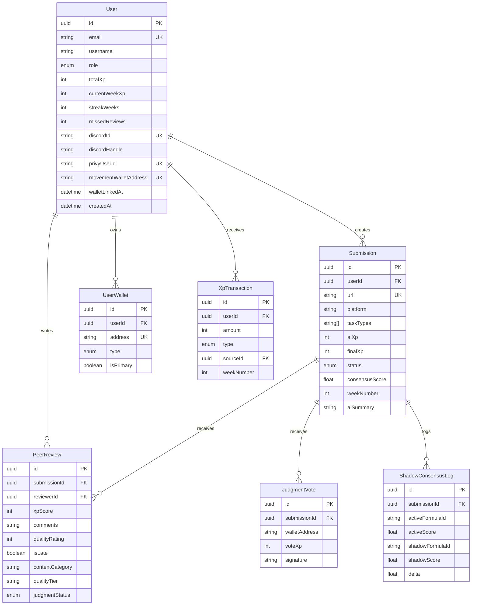

# Scholars_XP System Architecture Documentation

**Version**: 5.0  
**Last Updated**: January 2026  
**Status**: Production-Ready with Blockchain Integration

## Executive Summary

Scholars_XP is a comprehensive gamified content evaluation platform built with Next.js 15, Supabase, and PostgreSQL. The system enables users to submit content from various platforms (Twitter/X, Medium, Reddit, Notion) for peer review evaluation, implementing a sophisticated role-based access control system with three distinct user roles: USER, REVIEWER, and ADMIN. The platform includes on-chain community voting via Movement Network for resolving divergent peer review scores, Privy-based authentication with embedded wallets, and a data-driven reviewer reliability formula system.

### Key Architectural Principles

- **Serverless-First**: Designed for Vercel's serverless platform with database-backed persistence
- **Real-time Capabilities**: Supabase Realtime integration for instant notifications and updates
- **Security-Focused**: Multi-layered security with Privy authentication, authorization, and data protection
- **Scalable Design**: Horizontal scaling through serverless functions and database optimization
- **Performance Optimized**: Efficient queries, caching strategies, and background processing
- **Blockchain-Integrated**: On-chain voting via Movement Network with gasless transactions
- **Data-Driven Reliability**: Weighted reviewer scoring using configurable formula system

## System Architecture Overview



## Core Components Architecture

### 1. Authentication System (Privy + RBAC)

**Implementation**: `src/contexts/PrivyAuthSyncContext.tsx`, `src/lib/auth-middleware.ts`



**Authentication Flow**:
1. User authenticates via Privy (Discord OAuth or wallet connection)
2. Privy automatically creates an embedded Aptos/Movement wallet
3. `PrivyAuthSyncContext` syncs user data to Supabase
4. Discord handle, email, and wallet address are stored
5. Role-based access is enforced via middleware

**Role Hierarchy**:
- **USER** (Level 1): Content submission, view own data
- **REVIEWER** (Level 2): All USER permissions + peer review capabilities (auto-promoted at 1000 XP)
- **ADMIN** (Level 3): All permissions + system management

**Security Features**:
- Privy JWT-based authentication
- Automatic embedded wallet creation for all users
- Row Level Security (RLS) policies in Supabase
- Role-based route protection via middleware
- Database trigger for automatic REVIEWER promotion at 1000 XP

### 2. Wallet Integration System

**Implementation**: `src/contexts/WalletSyncContext.tsx`, `src/lib/wallet-provider.tsx`

The platform supports two wallet types:

| Wallet Type | Description | Use Case |
|-------------|-------------|----------|
| **Embedded** | Auto-created via Privy | Gasless voting, seamless UX |
| **External** | Connected via Nightly/browser extension | Advanced users, existing wallets |

**Wallet Architecture**:


**Key Features**:
- Automatic embedded wallet creation on first login
- Support for external wallet connections (Nightly, etc.)
- Wallet address validation (0x + 64 hex chars)
- One wallet per user enforcement
- Primary wallet designation for on-chain activities

### 3. Task System & XP Rules (V2)

**Implementation**: `src/lib/xp-rules-v2.ts`

The simplified V2 task system uses two task types with category-based XP ranges:

| Task | Description | Platforms | Categories |
|------|-------------|-----------|------------|
| **A** | Thread/Long Article | Twitter/X (5+ tweets or Article) | strategy, guide, technical |
| **B** | Platform Article | Medium, Reddit, Notion (2000+ chars) | strategy, guide, technical |

**XP Matrix by Task, Category, and Quality Tier**:

| Task | Category | Basic | Average | Awesome |
|------|----------|-------|---------|---------|
| A | strategy | 50 | 100 | 150 |
| A | guide | 30 | 80 | 130 |
| A | technical | 40 | 90 | 140 |
| B | strategy | 80 | 150 | 250 |
| B | guide | 60 | 130 | 230 |
| B | technical | 70 | 140 | 240 |

**Quality Tiers**:
- **Basic**: Meets minimum requirements
- **Average**: Good quality, well-structured
- **Awesome**: Exceptional quality, comprehensive

### 4. Reviewer Reliability Formula System

**Implementation**: `src/lib/reliability/`

The reliability system calculates weighted scores for reviewers to improve consensus accuracy.



**Reliability Metrics** (normalized 0-1):

| Metric | Description | Weight (Legacy) | Weight (Custom V1) |
|--------|-------------|-----------------|-------------------|
| Timeliness | On-time review completion | 30% | 31.7% |
| Quality | Average quality rating (1-5) | 70% | 0% |
| Accuracy | Deviation from final XP | 0% | 2.8% |
| Vote Validation | Validated vs invalidated votes | 0% | 1.4% |
| Experience | Total reviews (max 50) | 0% | 39.9% |
| Missed Penalty | Missed assignment rate | 0% | 2.2% |
| Penalty Score | Admin penalties applied | 0% | 13.3% |
| Review Variance | Consistency of scores | 0% | 3.2% |
| Late Percentage | Inverse of late rate | 0% | 5.5% |

**Formula Definitions**:

```typescript
// LEGACY (Production)
weights: { timeliness: 0.30, quality: 0.70, ... }

// CUSTOM_V1 (Shadow Mode)
weights: {
  timeliness: 0.317,
  experience: 0.399,
  penaltyScore: 0.133,
  latePercentage: 0.055,
  reviewVariance: 0.032,
  accuracy: 0.028,
  missedPenalty: 0.022,
  voteValidation: 0.014
}
```

**Reviewer Classification**:
- **Good Reviewers**: 25+ reviews, <10% miss rate, no penalties, 85%+ timeliness
- **Bad Reviewers**: 25%+ missed assignments OR 20+ penalty points OR multiple soft failures
- **Middle**: Everyone else

### 5. Consensus Calculator

**Implementation**: `src/lib/consensus-calculator.ts`



**Consensus Features**:
- Peer-only consensus (AI weight = 0)
- Outlier detection using Z-score (threshold: 2.0 std deviations)
- Reliability-weighted averaging
- Confidence levels: high (≥0.8), medium (≥0.6), low (<0.6)
- Shadow mode logging for formula comparison
- Automatic AI summary generation post-finalization

### 6. On-Chain Voting System (Movement Network)

**Implementation**: `src/lib/movement.ts`, `src/lib/vote-transactions.ts`, `src/lib/vote-consensus.ts`



**Vote Consensus Rules**:
- Minimum 50 votes required for consensus
- >50% agreement threshold for winner
- Winning reviews marked as `VALIDATED`
- Losing reviews marked as `INVALIDATED`
- Validation status affects reviewer reliability scores

**Movement Network Integration**:
- Network: Movement Testnet (Bardock)
- RPC: `https://testnet.movementnetwork.xyz/v1`
- Gasless transactions via Shinami Gas Station
- Vote contract: `scholarxp::vote::cast_vote`

### 7. Content Submission & Evaluation Workflow

**Implementation**: `src/app/api/submissions/route.ts`, `src/lib/submission-processing-queue.ts`



**Weekly Limits**:
- Maximum 5 finalized submissions per user per week
- Enforced at consensus calculation time

### 8. Notification System (Supabase Realtime)

**Implementation**: `src/lib/notifications.ts`

**Notification Types**:
| Type | Description |
|------|-------------|
| XP_AWARDED | Content evaluation completed |
| REVIEW_ASSIGNED | New peer review assignment |
| REVIEW_COMPLETED | Review submitted for your content |
| SUBMISSION_PROCESSED | Submission processing complete |
| STREAK_ACHIEVED | Weekly streak milestone |
| PENALTY_APPLIED | Missed review penalty |
| ADMIN_MESSAGE | System announcements |

## Database Schema & Relationships



## API Endpoints Documentation

### Authentication APIs

| Endpoint | Method | Auth | Purpose |
|----------|--------|------|---------|
| `/api/auth/sync` | POST | Privy | Sync Privy user to Supabase |
| `/api/user/me` | GET | User | Get current user profile |

### Content Management APIs

| Endpoint | Method | Auth | Purpose |
|----------|--------|------|---------|
| `/api/submissions` | POST | User | Submit content for evaluation |
| `/api/submissions` | GET | User | List user submissions |
| `/api/validate-content` | POST | User | Real-time content validation |

### Peer Review APIs

| Endpoint | Method | Auth | Purpose |
|----------|--------|------|---------|
| `/api/peer-reviews/pending` | GET | Reviewer | Get pending reviews |
| `/api/peer-reviews` | POST | Reviewer | Submit peer review |
| `/api/assignments/my` | GET | Reviewer | Get reviewer assignments |

### Voting APIs

| Endpoint | Method | Auth | Purpose |
|----------|--------|------|---------|
| `/api/vote/submit` | POST | User | Submit on-chain vote |
| `/api/vote/status` | GET | Public | Get vote counts for submission |

### Administrative APIs

| Endpoint | Method | Auth | Purpose |
|----------|--------|------|---------|
| `/api/admin/stats` | GET | Admin | System statistics |
| `/api/admin/users` | POST | Admin | User management |
| `/api/admin/update-xp` | POST | Admin | Manual XP adjustments |

## Environment Configuration

**Required Environment Variables**:
```env
# Database
DATABASE_URL="postgresql://..."
DIRECT_URL="postgresql://..."

# Supabase
NEXT_PUBLIC_SUPABASE_URL="https://..."
NEXT_PUBLIC_SUPABASE_ANON_KEY="..."
SUPABASE_SERVICE_ROLE_KEY="..."

# Privy Authentication
NEXT_PUBLIC_PRIVY_APP_ID="..."
PRIVY_APP_SECRET="..."

# Movement Network
NEXT_PUBLIC_MOVEMENT_RPC_URL="https://testnet.movementnetwork.xyz/v1"
NEXT_PUBLIC_VOTE_CONTRACT="0x..."

# Shinami Gas Station
SHINAMI_API_KEY="..."

# AI Services (Optional - disabled in production)
OPENROUTER_API_KEY="..."

# Feature Flags
ENABLE_AI_EVALUATION=false
ENABLE_LEGACY_DUPLICATE_CHECK=true
```

## Security Architecture

### Authentication & Authorization

**Multi-layered Security**:
1. **Privy Auth**: JWT-based authentication with Discord OAuth
2. **Embedded Wallets**: Secure key management via Privy
3. **Middleware Protection**: Route-level authentication checks
4. **Database RLS**: Row-level security policies in PostgreSQL

### Data Protection

- Input validation for all API endpoints
- Wallet address format validation
- SQL injection prevention via Prisma ORM
- Rate limiting (PostgreSQL-based for serverless)
- XSS protection headers

## Performance Optimization

### Database Optimization

**Key Indexes**:
- `User(totalXp DESC)` - Leaderboard queries
- `User(movementWalletAddress)` - Wallet lookups
- `Submission(userId, createdAt)` - User activity
- `PeerReview(reviewerId, createdAt)` - Reviewer analytics
- `JudgmentVote(submissionId)` - Vote aggregation

### Reliability Service Optimization

The reliability service uses aggregated SQL queries instead of loading all records:
- Single query for review statistics
- Single query for deviation calculations
- Single query for penalty totals
- Parallel execution of all queries

## Deployment Architecture

### Vercel Serverless Deployment

- Next.js 15 with App Router
- Serverless functions for API routes
- Edge middleware for authentication
- Prisma connection pooling

### Background Processing

- Database-backed job queues
- Supabase pg_cron for scheduled operations
- Automatic retry mechanisms
- Shadow mode logging (non-blocking)

## Monitoring & Observability

### Key Metrics

- Consensus calculation success rate
- Reviewer reliability score distribution
- Vote consensus achievement rate
- XP transaction volume
- API response times

### Logging

- `AutomationLog` table for cron jobs
- `ShadowConsensusLog` for formula comparison
- `SystemLog` for errors and warnings
- `VoteAnalyticsEvent` for voting behavior

## Conclusion

Scholars_XP v5.0 represents a mature, production-ready platform with:

- **Privy Authentication**: Seamless Discord OAuth with embedded wallets
- **Movement Network Integration**: On-chain voting with gasless transactions
- **Data-Driven Reliability**: Configurable formula system with shadow mode testing
- **Simplified Task System**: Two task types with category-based XP ranges
- **Peer-Only Consensus**: Weighted averaging with outlier detection

The architecture supports horizontal scaling, maintains security best practices, and provides comprehensive observability for production operations.
