# Scholars_XP System Architecture Documentation

## Table of Contents
1. [System Overview](#system-overview)
2. [High-Level Architecture](#high-level-architecture)
3. [Authentication & Authorization](#authentication--authorization)
4. [User Management System](#user-management-system)
5. [Database Schema](#database-schema)
6. [API Architecture](#api-architecture)
7. [Security Considerations](#security-considerations)
8. [Technology Stack](#technology-stack)
9. [Component Architecture](#component-architecture)
10. [Data Flow](#data-flow)

## System Overview

Scholars_XP is a comprehensive XP evaluation system built with Next.js 15, Supabase, and PostgreSQL. The system enables users to submit content for AI evaluation and peer review, implementing a sophisticated role-based access control system with three distinct user roles: USER, REVIEWER, and ADMIN.

### Key Features
- **Content Submission & Evaluation**: Users submit content from platforms like Twitter/X and Medium
- **AI-Powered Assessment**: OpenAI GPT-4 evaluates content and assigns XP scores
- **Peer Review System**: Community-driven review process for quality assurance
- **Gamification**: XP tracking, streaks, leaderboards, and weekly caps
- **Admin Management**: Comprehensive administrative oversight and system operations

## High-Level Architecture

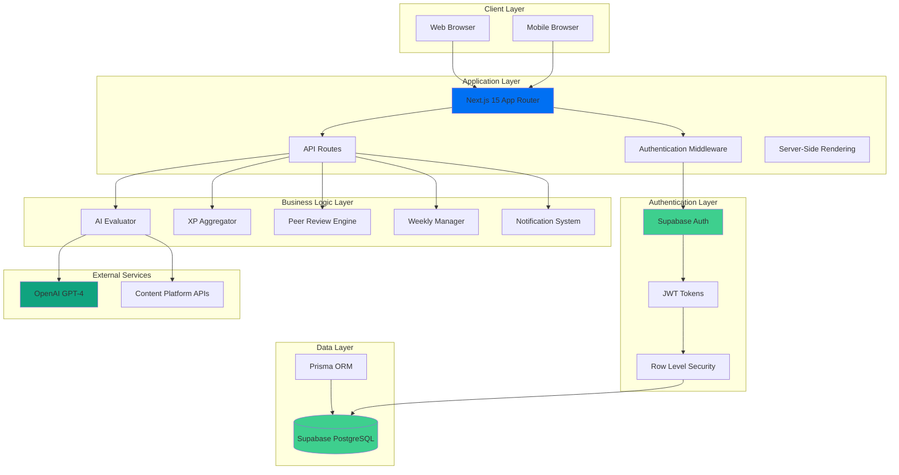

## Authentication & Authorization

### Role-Based Access Control (RBAC) Implementation

The system implements a three-tier role hierarchy with granular permissions:

```mermaid
graph TD
    subgraph "Role Hierarchy"
        ADMIN[ADMIN - Level 3]
        REVIEWER[REVIEWER - Level 2]
        USER[USER - Level 1]
    end
    
    subgraph "Permissions"
        SUBMIT[submit_content]
        REVIEW[review_content]
        ADMIN_ACCESS[admin_access]
        MANAGE_USERS[manage_users]
        VIEW_ANALYTICS[view_analytics]
        VIEW_LEADERBOARD[view_leaderboard]
        VIEW_OWN_SUBS[view_own_submissions]
        VIEW_REVIEW_DASH[view_review_dashboard]
        VIEW_ADMIN_DASH[view_admin_dashboard]
        MANAGE_SUBS[manage_submissions]
        SYSTEM_OPS[system_operations]
    end
    
    USER --> SUBMIT
    USER --> VIEW_LEADERBOARD
    USER --> VIEW_OWN_SUBS
    
    REVIEWER --> SUBMIT
    REVIEWER --> REVIEW
    REVIEWER --> VIEW_LEADERBOARD
    REVIEWER --> VIEW_OWN_SUBS
    REVIEWER --> VIEW_REVIEW_DASH
    
    ADMIN --> SUBMIT
    ADMIN --> REVIEW
    ADMIN --> ADMIN_ACCESS
    ADMIN --> MANAGE_USERS
    ADMIN --> VIEW_ANALYTICS
    ADMIN --> VIEW_LEADERBOARD
    ADMIN --> VIEW_OWN_SUBS
    ADMIN --> VIEW_REVIEW_DASH
    ADMIN --> VIEW_ADMIN_DASH
    ADMIN --> MANAGE_SUBS
    ADMIN --> SYSTEM_OPS
    
    style ADMIN fill:#ff6b6b
    style REVIEWER fill:#4ecdc4
    style USER fill:#45b7d1
```

### Authentication Flow

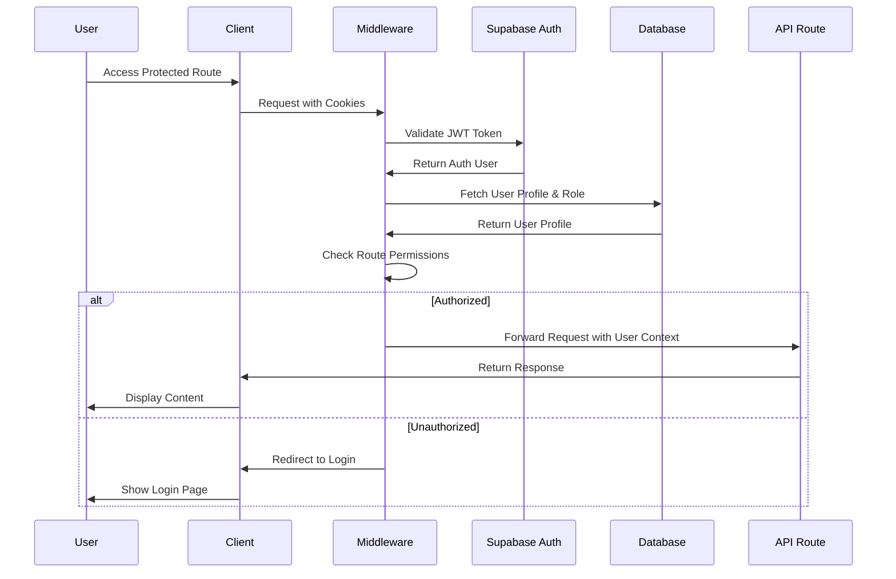

### Permission Matrix

| Role | Submit Content | Review Content | Admin Access | Manage Users | View Analytics |
|------|----------------|----------------|--------------|--------------|----------------|
| USER | ✅ | ❌ | ❌ | ❌ | ❌ |
| REVIEWER | ✅ | ✅ | ❌ | ❌ | ❌ |
| ADMIN | ✅ | ✅ | ✅ | ✅ | ✅ |

## User Management System

### User Lifecycle

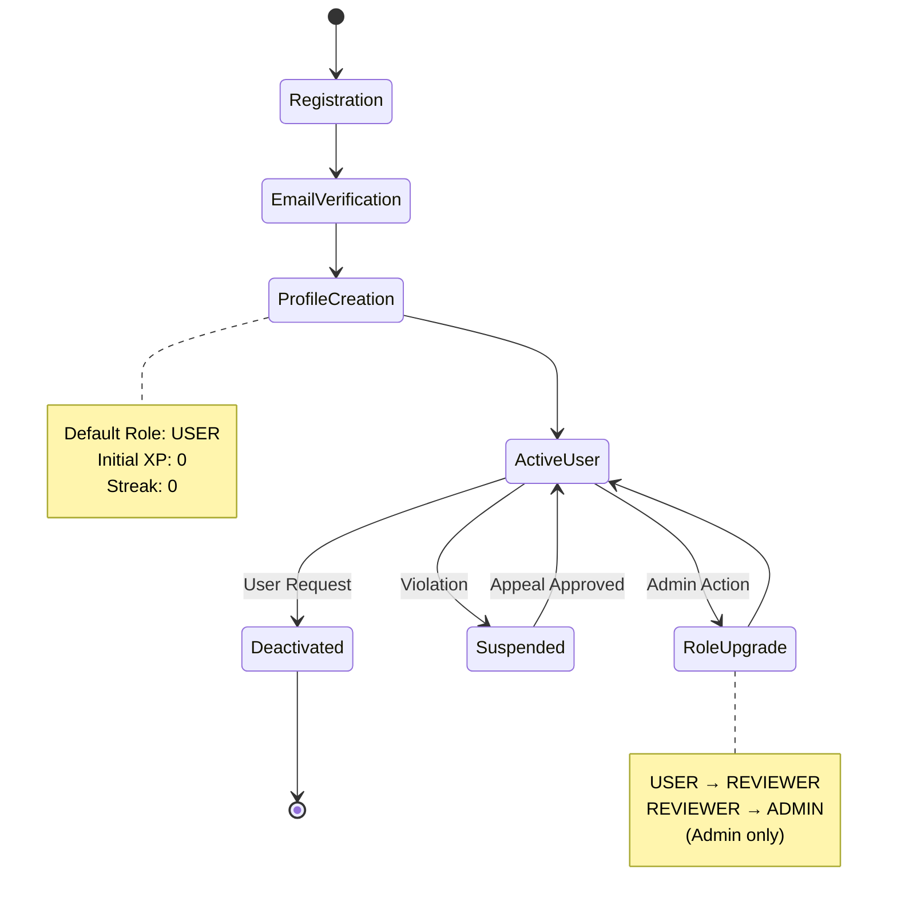

### User Profile Management

The system maintains comprehensive user profiles with the following attributes:

- **Identity**: ID (UUID), email, username
- **Role**: USER, REVIEWER, or ADMIN
- **XP Tracking**: Total XP, current week XP, streak weeks
- **Performance**: Missed reviews count
- **Timestamps**: Created at, updated at

## Database Schema

### Entity Relationship Diagram

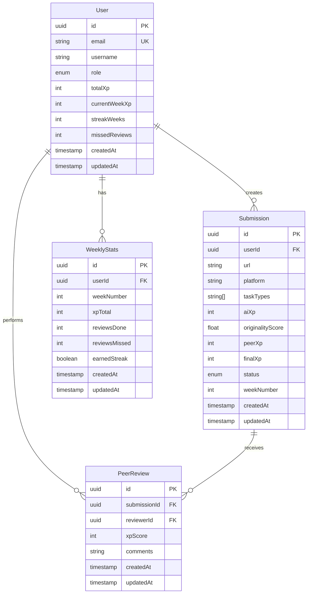

### Key Database Constraints

- **User.email**: Unique constraint for authentication
- **WeeklyStats**: Unique constraint on (userId, weekNumber)
- **Submission.status**: Enum values (PENDING, AI_REVIEWED, UNDER_PEER_REVIEW, FINALIZED, FLAGGED, REJECTED)
- **User.role**: Enum values (USER, REVIEWER, ADMIN)

## API Architecture

### REST API Endpoints Structure

```mermaid
graph LR
    subgraph "Public APIs"
        AUTH[/api/auth/*]
        TEST[/api/test-supabase]
        DEBUG[/api/debug-user]
    end
    
    subgraph "User APIs"
        SUBMISSIONS[/api/submissions]
        EVALUATE[/api/evaluate]
        PROFILE[/api/user/profile]
        LEADERBOARD[/api/leaderboard]
        NOTIFICATIONS[/api/notifications]
    end
    
    subgraph "Reviewer APIs"
        PEER_REVIEWS[/api/peer-reviews]
        PENDING[/api/peer-reviews/pending]
    end
    
    subgraph "Admin APIs"
        ADMIN_STATS[/api/admin/stats]
        ADMIN_SUBS[/api/admin/submissions]
        AGGREGATE_XP[/api/aggregate-xp]
        WEEKLY[/api/weekly]
    end
    
    style AUTH fill:#95a5a6
    style SUBMISSIONS fill:#45b7d1
    style PEER_REVIEWS fill:#4ecdc4
    style ADMIN_STATS fill:#ff6b6b
```

### API Authentication Middleware

The system uses a sophisticated middleware pattern for API route protection:

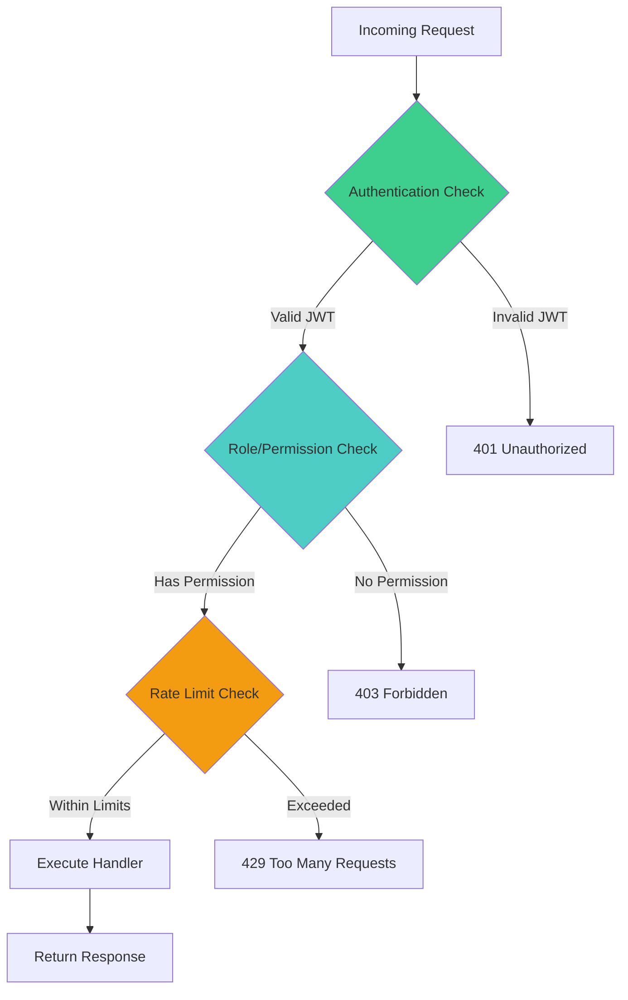

### API Endpoint Categories

#### 1. Content Management APIs

- **POST /api/submissions**: Submit new content for evaluation
- **GET /api/submissions**: List submissions (filtered by user role)
- **POST /api/evaluate**: Trigger AI evaluation of submitted content

#### 2. Peer Review APIs

- **GET /api/peer-reviews/pending**: Get pending reviews for reviewer
- **POST /api/peer-reviews**: Submit peer review with XP score and comments

#### 3. System Operation APIs

- **POST /api/aggregate-xp**: Process XP aggregation (Admin only)
- **POST /api/weekly**: Trigger weekly operations (Admin only)
- **GET /api/leaderboard**: Retrieve leaderboard data

#### 4. Administrative APIs

- **GET /api/admin/stats**: System statistics and metrics
- **GET /api/admin/submissions**: Manage all submissions
- **PATCH /api/admin/submissions**: Update submission status

## Security Considerations

### Row Level Security (RLS) Implementation

The system leverages Supabase's Row Level Security for database-level access control:

```sql
-- Example RLS Policy for User table
CREATE POLICY "Users can view own profile" ON "User"
    FOR SELECT USING (auth.uid() = id);

CREATE POLICY "Users can update own profile" ON "User"
    FOR UPDATE USING (auth.uid() = id);

-- Example RLS Policy for Submissions
CREATE POLICY "Users can view own submissions" ON "Submission"
    FOR SELECT USING (auth.uid() = "userId");

CREATE POLICY "Reviewers can view all submissions" ON "Submission"
    FOR SELECT USING (
        EXISTS (
            SELECT 1 FROM "User"
            WHERE id = auth.uid()
            AND role IN ('REVIEWER', 'ADMIN')
        )
    );
```

### Security Measures

#### 1. Input Validation & Sanitization

- URL format validation for content submissions
- XP score bounds checking (0-100 range)
- Content length limits and hashtag requirements
- SQL injection prevention through Prisma ORM

#### 2. Rate Limiting Configuration

```typescript
// Rate limits by endpoint type
const RATE_LIMITS = {
  submissions: { requests: 10, window: 60000 }, // 10 per minute
  reviews: { requests: 20, window: 60000 },     // 20 per minute
  admin: { requests: 100, window: 60000 },      // 100 per minute
  general: { requests: 60, window: 60000 }      // 60 per minute
}
```

#### 3. Security Headers (Production)

- X-Frame-Options: DENY
- X-Content-Type-Options: nosniff
- X-XSS-Protection: 1; mode=block
- Referrer-Policy: strict-origin-when-cross-origin
- Content Security Policy (CSP)

#### 4. Authentication Security

- JWT token validation on every request
- Automatic token refresh handling
- Session persistence with secure cookies
- PKCE flow for OAuth authentication

## Technology Stack

### Core Technologies

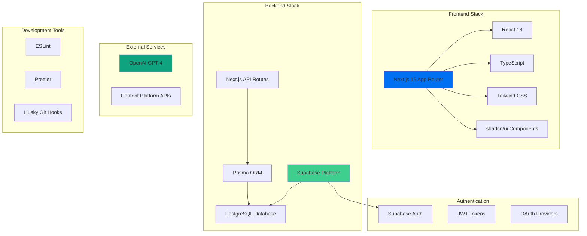

### Key Dependencies

| Category | Technology | Version | Purpose |
|----------|------------|---------|---------|
| Framework | Next.js | 15.x | Full-stack React framework |
| Database | PostgreSQL | Latest | Primary database |
| ORM | Prisma | Latest | Database access layer |
| Auth | Supabase Auth | Latest | Authentication & authorization |
| AI | OpenAI API | Latest | Content evaluation |
| UI | shadcn/ui | Latest | Component library |
| Styling | Tailwind CSS | Latest | Utility-first CSS |
| Language | TypeScript | Latest | Type safety |

## Component Architecture

### Frontend Component Hierarchy

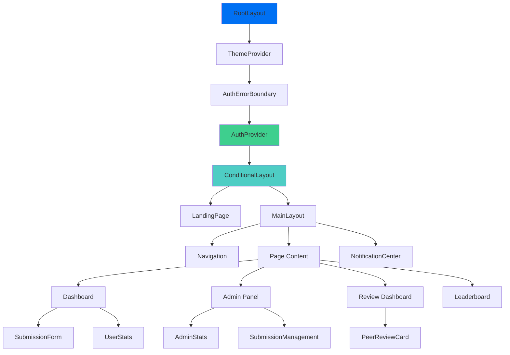

### Key Components

#### 1. Authentication Components

- **AuthProvider**: Global authentication state management
- **AuthErrorBoundary**: Error handling for auth failures
- **ConditionalLayout**: Route-based layout switching

#### 2. Core UI Components

- **Navigation**: Role-based navigation menu
- **SubmissionForm**: Content submission interface
- **PeerReviewCard**: Review assignment interface
- **NotificationCenter**: Real-time notification system

#### 3. Admin Components

- **AdminPanel**: System management interface
- **AdminStats**: System metrics dashboard
- **SubmissionManagement**: Content moderation tools

## Data Flow

### Content Submission & Evaluation Flow

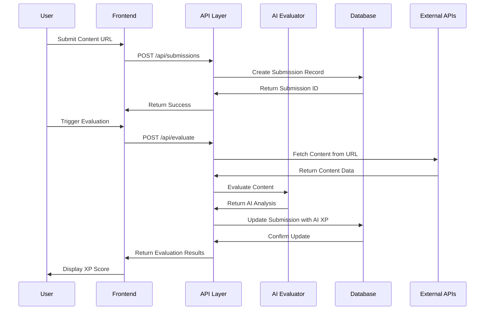

### Peer Review Assignment Flow

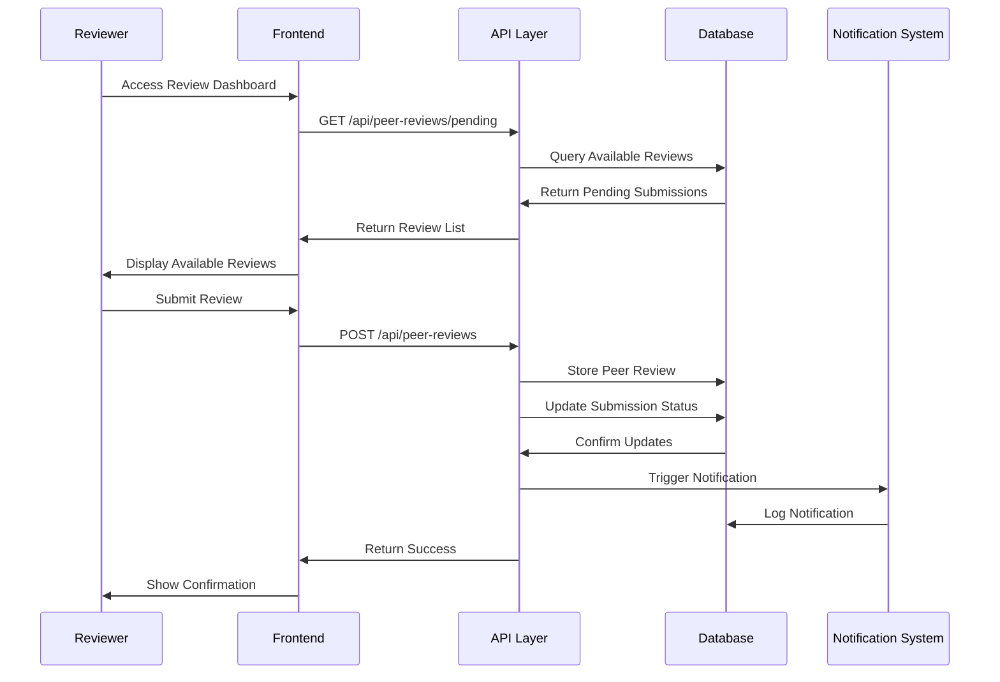

### Weekly Operations Flow

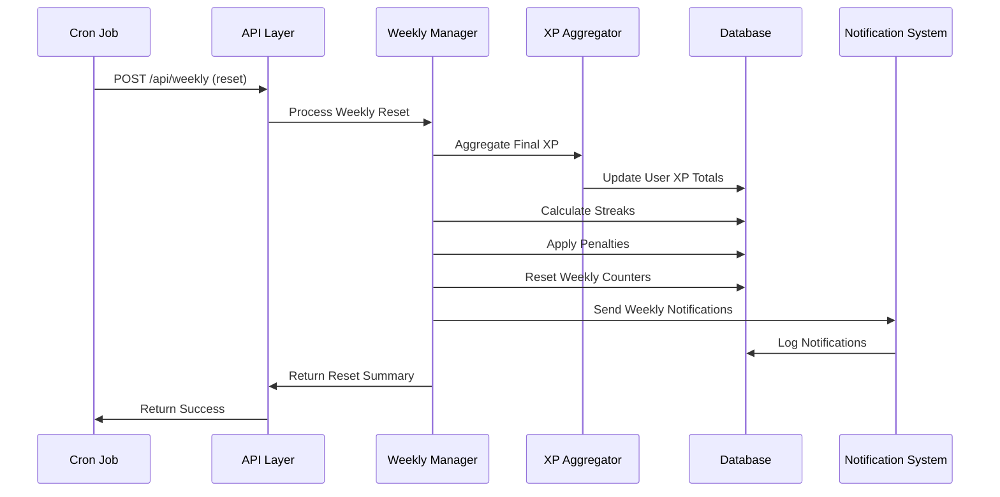

---

## Conclusion

The Scholars_XP system represents a sophisticated, production-ready application built on modern web technologies. Its architecture emphasizes security, scalability, and maintainability through:

- **Robust Authentication**: Multi-layered security with Supabase Auth and RLS
- **Role-Based Access Control**: Granular permissions system
- **Scalable Database Design**: Normalized schema with proper constraints
- **API-First Architecture**: RESTful endpoints with comprehensive middleware
- **Modern Frontend**: React-based UI with TypeScript and component libraries
- **AI Integration**: Seamless OpenAI integration for content evaluation

This architecture supports the system's core mission of providing a fair, transparent, and engaging platform for content evaluation and peer review while maintaining the highest standards of security and user experience.
