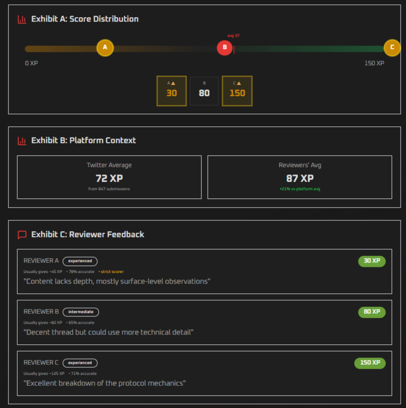
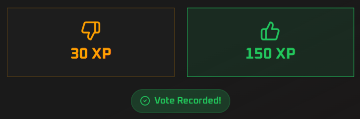
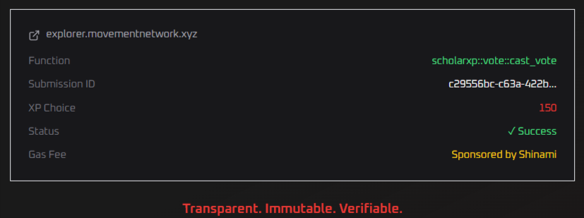
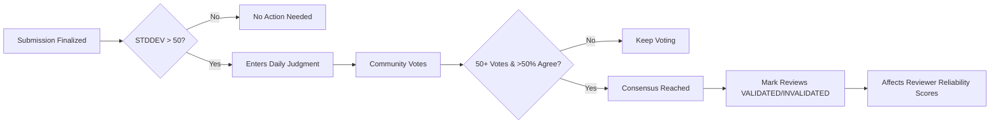
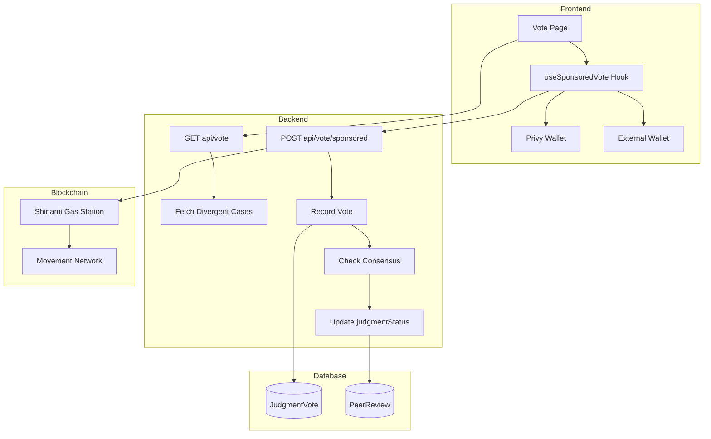
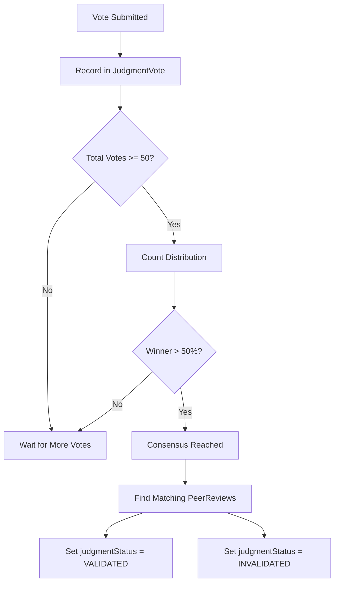
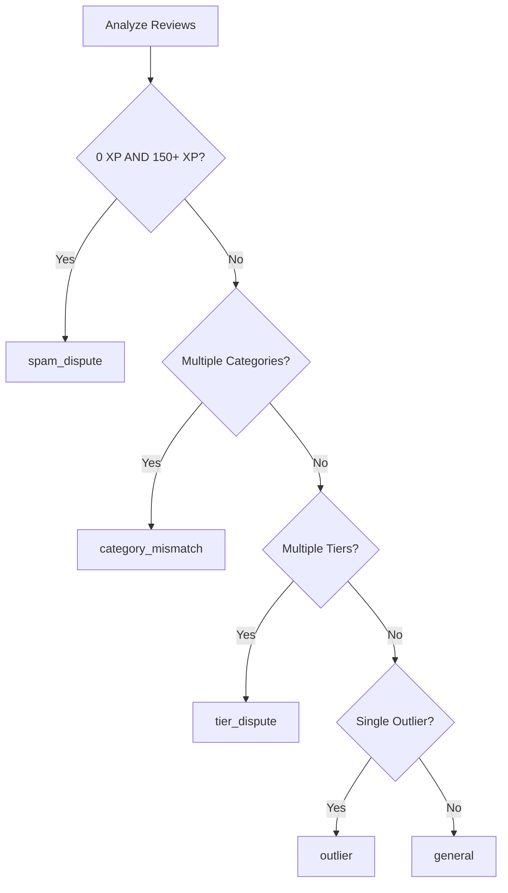
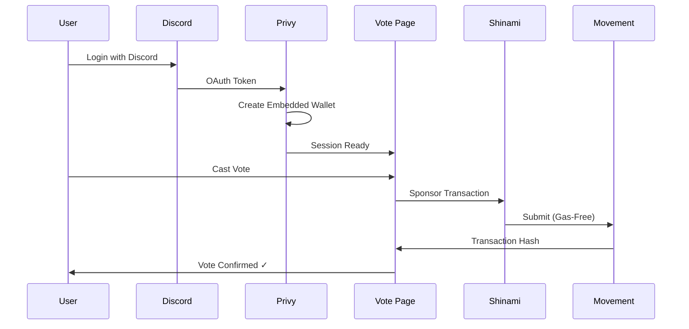

<p align="center">
  
</p>

<h1 align="center">The Daily Judgment</h1>

<p align="center">
  <strong>On-chain community voting to validate peer reviewers</strong>
</p>

<p align="center">
  <a href="https://scholars-xp.vercel.app/vote">Try it Live</a> •
  <a href="https://scholars-xp.vercel.app/pitch">View Pitch Deck</a> •
  <a href="#how-it-works">How it Works</a> •
  <a href="#architecture">Architecture</a> •
  <a href="#reliability-system">Reliability</a>
</p>

<p align="center">
  <a href="https://github.com/dimzachar/ScholarsXP"></a>
  <a href="https://scholars-xp.vercel.app"></a>
  <a href="#"></a>
</p>

---

## ✨ Features

- 🗳️ **On-Chain Voting** — Every vote recorded on Movement Network
- ⛽ **Gas-Free** — Shinami sponsors all transaction fees
- 🔐 **Discord Login** — Privy creates wallets automatically, no seed phrases
- 📊 **Rich Case Context** — Reviewer stats, platform benchmarks, conflict analysis
- 🎯 **Reviewer Validation** — Community consensus updates reliability scores

---

## 🖼️ Screenshots

<p align="center">
  
</p>
<p align="center">
  <em>Case Header — High Divergence Detected</em>
</p>

When reviewers disagree significantly, the submission enters "The Daily Judgment" with a clear divergence alert.

<p align="center">
  
</p>
<p align="center">
  <em>Case Details with Score Distribution & Reviewer Feedback</em>
</p>

The voting interface presents each case as a "Case File" with:
- **Score Distribution** — Visual bar showing where each reviewer scored, with outlier detection
- **Platform Context** — How this submission compares to platform averages
- **Reviewer Feedback** — Comments, experience levels, and historical accuracy

<p align="center">
  
</p>
<p align="center">
  <em>Verdict Buttons with Randomized Position</em>
</p>

Vote buttons are randomized per case to prevent position bias. One click submits your vote on-chain.

<p align="center">
  
</p>
<p align="center">
  <em>On-Chain Transaction Confirmation</em>
</p>

---

## 🏆 Hackathon

This feature was built for the **M1 Hackathon** powered by Replit.

**Key integrations:**
- Movement Network (Aptos-based L1)
- Privy embedded wallets
- Shinami gas sponsorship

---

## The Problem

When peer reviewers evaluate content, they sometimes disagree — significantly.

```
Reviewer A:  30 XP   "Content lacks depth"
Reviewer B:  80 XP   "Decent thread"  
Reviewer C: 150 XP   "Excellent breakdown"
```

**Who was right?** The submission already has a `finalXp` from peer consensus. But which reviewer should we trust more in the future?

## The Solution

**The Daily Judgment** lets the community vote on which reviewer's score was correct. This doesn't change the submission's XP — it updates **reviewer reliability scores** for future weighted consensus.




---

## How It Works

### 1. Divergence Detection

Finalized submissions with high reviewer disagreement are surfaced for voting:

```sql
SELECT s.id, STDDEV(pr."xpScore") as divergence
FROM "Submission" s
JOIN "PeerReview" pr ON s.id = pr."submissionId"
WHERE s.status = 'FINALIZED'
  AND s."createdAt" >= NOW() - INTERVAL '90 days'
GROUP BY s.id
HAVING STDDEV(pr."xpScore") > 50
ORDER BY STDDEV(pr."xpScore") DESC
```

### 2. Case Presentation

Voters see:
- Original content URL
- All reviewer scores and feedback
- Reviewer experience levels and historical accuracy
- Platform benchmarks for context

### 3. On-Chain Voting

Each vote is recorded on **Movement Network** (Aptos-based L1):

```
Function:      scholarxp::vote::cast_vote
Submission:    c29556bc-c63a-422b...
XP Choice:     150
Status:        ✓ Success
Gas Fee:       Sponsored by Shinami
```

### 4. Reviewer Validation

When consensus is reached, reviews are marked:
- **VALIDATED**: Reviewer's score matched the community consensus
- **INVALIDATED**: Reviewer's score was rejected by the community

This feeds into the **Reliability Score System**.

---

## Architecture




### Tech Stack

| Component | Technology | Purpose |
|-----------|------------|---------|
| Blockchain | Movement Network | Immutable vote storage |
| Wallet Auth | Privy | Embedded + external wallet support |
| Gas Sponsorship | Shinami | Zero-cost voting for users |
| Backend | Next.js API Routes | Vote processing & consensus |
| Database | PostgreSQL/Prisma | Vote records & reviewer stats |

---

## Consensus Algorithm

### Parameters

```typescript
const MIN_VOTES_FOR_CONSENSUS = 50   // Minimum votes required
const CONSENSUS_THRESHOLD = 0.50     // >50% agreement needed
```

### Process



### What Happens on Consensus

```typescript
// Only updates PeerReview.judgmentStatus - NOT the submission's finalXp
await prisma.$transaction(
  reviews.map(review => {
    const validated = review.xpScore === winningXp
    return prisma.peerReview.update({
      where: { id: review.id },
      data: {
        judgmentStatus: validated ? 'VALIDATED' : 'INVALIDATED'
      }
    })
  })
)
```

---

## Reliability System


The vote validation feeds into a **Reviewer Reliability Score** that affects future peer review weighting.

### Vote Validation Metric

```typescript
// Formula: max(0, min(1.0, baseline + (validated * bonus) - (invalidated * penalty)))
VOTE_VALIDATION_PARAMS: {
  baseline: 0.65,   // Start at 65%
  bonus: 0.02,      // +2% per VALIDATED review
  penalty: 0.05,    // -5% per INVALIDATED review
}

// Example: Reviewer with 3 validated, 1 invalidated
// 0.65 + (3 * 0.02) - (1 * 0.05) = 0.66 (66%)
```

### Reliability Score Formula

The system supports multiple weighted formulas that combine metrics like `voteValidation`, `experience`, `timeliness`, `accuracy`, and `penaltyScore`. Formulas can be tuned and A/B tested via shadow mode.

### Metrics Calculated

| Metric | Formula | Description |
|--------|---------|-------------|
| `experience` | `min(1, totalReviews / 50)` | 0-1 based on review count |
| `timeliness` | `1 - (lateReviews / totalReviews)` | On-time submission rate |
| `accuracy` | `1 - (avgDeviation / 100)` | How close to finalXp |
| `voteValidation` | `0.65 + (validated * 0.02) - (invalidated * 0.05)` | Community trust |
| `penaltyScore` | `max(0, 1 - (totalPenalty / 100))` | Admin penalty impact |
| `missedPenalty` | `max(0, 1 - (missedReviews * 0.25))` | Assignment completion |

---

## Reviewer Analytics


Each reviewer in a case shows credibility context:

### Stats Query

```sql
SELECT 
  pr."reviewerId",
  COUNT(*) as "totalReviews",
  AVG(pr."xpScore") as "avgXpGiven",
  COUNT(*) FILTER (WHERE pr."xpScore" = 0) as "zeroScoreCount",
  COUNT(*) FILTER (WHERE pr."xpScore" >= 200) as "highScoreCount",
  COUNT(*) FILTER (WHERE pr."judgmentStatus" = 'VALIDATED') as "validatedVotes",
  COUNT(*) FILTER (WHERE pr."judgmentStatus" = 'INVALIDATED') as "invalidatedVotes",
  COUNT(*) FILTER (
    WHERE s."finalXp" IS NOT NULL 
    AND ABS(pr."xpScore" - s."finalXp") <= 50
  ) as "alignedCount"
FROM "PeerReview" pr
LEFT JOIN "Submission" s ON pr."submissionId" = s.id
GROUP BY pr."reviewerId"
```

### Experience Levels

```typescript
experienceLevel: total < 10 ? 'new' : total < 50 ? 'intermediate' : 'experienced'
```

### Consensus Alignment

```typescript
// % of reviews within 50 XP of final score
consensusAlignment = (alignedCount / finalizedCount) * 100
```

---

## Conflict Detection

The system categorizes disagreements:



| Type | Description |
|------|-------------|
| `spam_dispute` | One gave 0 XP, others rated highly |
| `category_mismatch` | Different content categories assigned |
| `tier_dispute` | Different quality tiers (basic/average/awesome) |
| `outlier` | One score far from average |
| `general` | Wide variance, no clear pattern |

---

## Web3 UX


### Zero Friction Flow



| Traditional Web3 | ScholarsXP |
|------------------|------------|
| Install MetaMask | Login with Discord |
| Save seed phrase | Privy handles keys |
| Buy gas tokens | Shinami sponsors gas |
| Approve popup | One-click voting |

---

## API Reference

### GET `/api/vote`

```typescript
// Query: ?userId=<uuid> (filters out already-voted)
// Response:
{
  cases: [{
    submissionId: string
    url: string
    platform: string
    divergentScores: [number, number]  // [min, max]
    stdDev: number
    reviews: ReviewerFeedback[]
    conflict: { type: string, description: string }
  }],
  total: number
}
```

### POST `/api/vote/sponsored`

```typescript
// Request:
{
  submissionId: string
  voteXp: number
  serializedTransaction: string
  serializedSignature: string
}

// Response:
{ success: true, transactionHash: string }
```

---

## 🚀 Quick Start

```bash
# 1. Visit the app
https://scholars-xp.vercel.app/vote

# 2. Login with Discord
# Privy creates an embedded wallet automatically

# 3. Start voting!
# Gas fees are sponsored — completely free
```

No wallet setup. No gas tokens. Just vote.

---

## Security

- **On-chain duplicate check**: Verify wallet hasn't voted before sponsoring
- **Database backup check**: Cross-reference all user wallets
- **Signature verification**: Transaction signed by linked wallet

---

## 📚 Related Docs

- [ARCHITECTURE.md](./ARCHITECTURE.md) — Full system architecture
- [README.md](./README.md) — Main project documentation

---

<p align="center">
  <a href="https://scholars-xp.vercel.app/vote">
    
  </a>
</p>

<p align="center">
  <em>Reviewer Trust by Community Consensus</em>
</p>

<p align="center">
  <a href="https://movementlabs.xyz"></a>
  <a href="https://privy.io"></a>
  <a href="https://shinami.com"></a>
</p>
